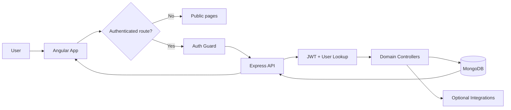
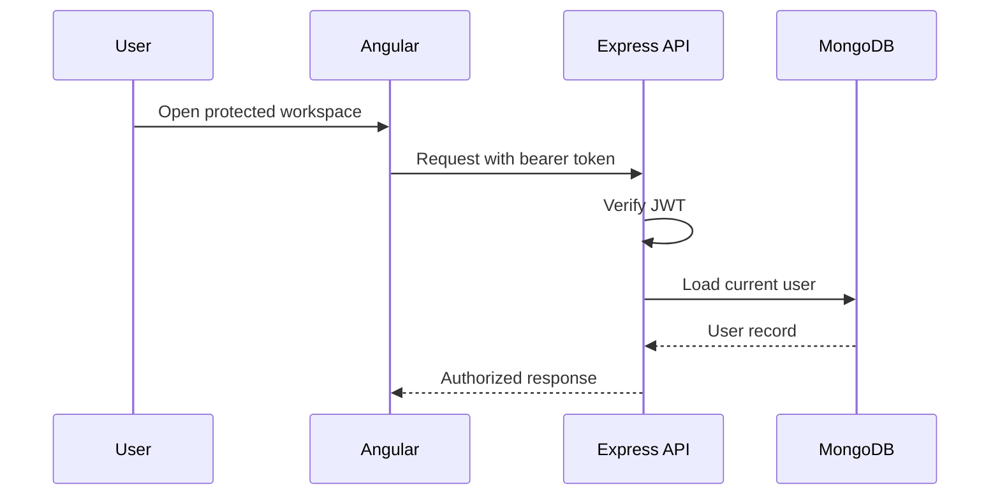
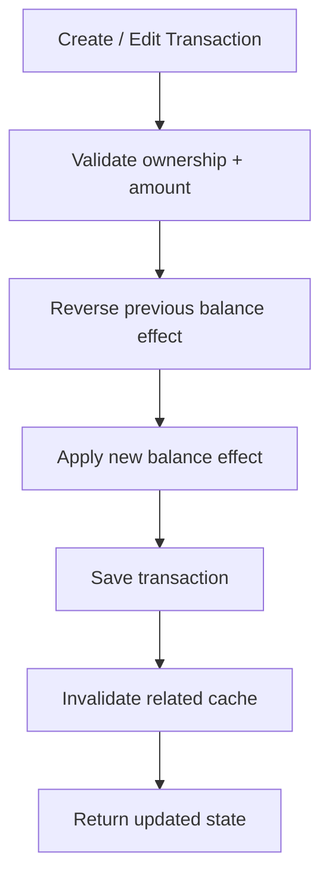
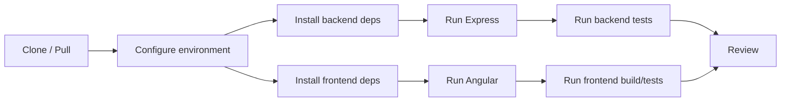
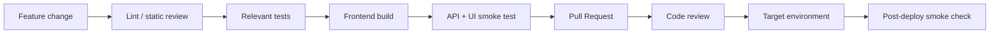

# PadelLifeHub — Development Pipeline

> Code-grounded architecture and delivery guide for the current repository snapshot. Reviewed from `master` at `c6cbe598b281` on 2026-09-17.

PadelLifeHub is an Angular productivity and personal-finance application backed by Express, JWT authentication, Mongoose, and MongoDB. The pipeline below separates what is implemented today from what still needs validation before release.

## 1. System pipeline

## 2. Main application flows

### Authentication flow

### Finance transaction flow

This path performs multiple writes. Treat failure recovery and balance reconciliation as a release-critical test area rather than assuming the operation is atomic.

## 3. Runtime ownership

| Layer | Responsibility | Key source |
| --- | --- | --- |
| Angular | Routing, guarded workspace, UI state | `frontend/src/app/app.routes.ts` |
| Express | API entry point and middleware | `backend/app.js` |
| Auth | Bearer-token validation and user lookup | `backend/middleware/auth.js` |
| Finance | Transaction and balance behavior | `backend/controllers/transactionController.js` |
| Persistence | User/domain records | MongoDB via Mongoose |
| Integrations | AI, email, media, scheduled jobs | Optional external services |

## 4. Technology snapshot

| Area | Declared stack |
| --- | --- |
| Frontend | Angular `^21.2.0`, TypeScript `~5.9.2` |
| Backend | Express `^4.21.2` |
| Database | MongoDB + Mongoose `^8.9.5` |
| Auth | JWT bearer-token flow |
| Tests | Node test runner + Angular test command |

## 5. Local development pipeline

| Directory | Command | Purpose |
| --- | --- | --- |
| `backend` | `npm run dev` | Start Express with nodemon |
| `backend` | `npm run start` | Start backend normally |
| `backend` | `npm run test` | Run backend tests |
| `frontend` | `npm run start` | Run Angular dev server |
| `frontend` | `npm run build` | Production frontend build |
| `frontend` | `npm run test` | Angular tests |

## 6. Verification gates

Before a change is considered ready, verify the behavior relevant to the diff:

- Protected-route reload and expired/invalid authentication.
- Cross-user access attempts against tasks, accounts, transactions, goals, and habits.
- Transaction create/edit/delete balance reconciliation.
- Failure between balance writes and transaction persistence.
- Transfer-account validation and invalid account references.
- Recurring dates and edge dates.
- Integration-disabled behavior when AI/email/media services are unavailable.

The repository contains backend tests for AI, finance insights, focus sessions, investments, notifications, exports, and related services. Their presence is not equivalent to a passing release; run the applicable suite.

## 7. Release pipeline

No GitHub Actions workflow was present in the reviewed snapshot, so these gates are currently procedural unless CI is added later.

## 8. Known gaps / next hardening work

1. **Finance atomicity:** transaction balance updates span multiple writes; validate rollback/recovery behavior.
2. **External integrations:** email, AI, media, and scheduled jobs require separately configured services.
3. **CI:** no `.github/workflows/` pipeline is present in this snapshot.
4. **Release evidence:** do not claim a build/test passed unless the command was actually executed against the target change.

## 9. Source map

- [`backend/app.js`](https://github.com/HidayahMF/PadelLifeHub/blob/c6cbe598b2812e768977ee0d75f01197734e2a29/backend/app.js)
- [`backend/controllers/transactionController.js`](https://github.com/HidayahMF/PadelLifeHub/blob/c6cbe598b2812e768977ee0d75f01197734e2a29/backend/controllers/transactionController.js)
- [`backend/middleware/auth.js`](https://github.com/HidayahMF/PadelLifeHub/blob/c6cbe598b2812e768977ee0d75f01197734e2a29/backend/middleware/auth.js)
- [`frontend/src/app/app.routes.ts`](https://github.com/HidayahMF/PadelLifeHub/blob/c6cbe598b2812e768977ee0d75f01197734e2a29/frontend/src/app/app.routes.ts)
- [`backend/.env.example`](https://github.com/HidayahMF/PadelLifeHub/blob/c6cbe598b2812e768977ee0d75f01197734e2a29/backend/.env.example)

Keep this document synchronized when entry points, authentication, persistence, finance rules, or integration contracts change.