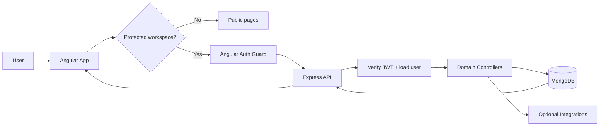
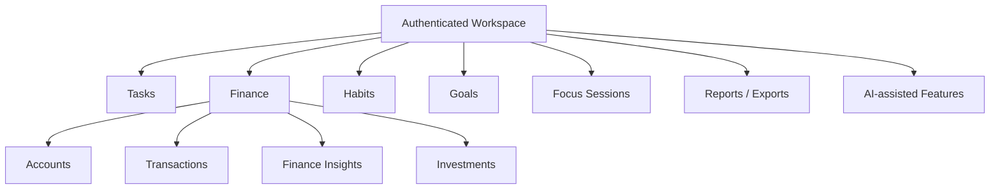
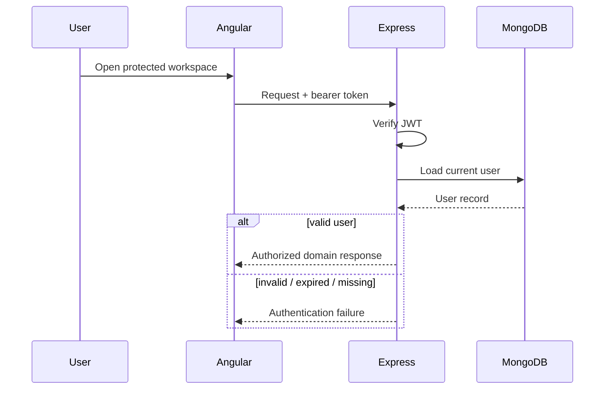
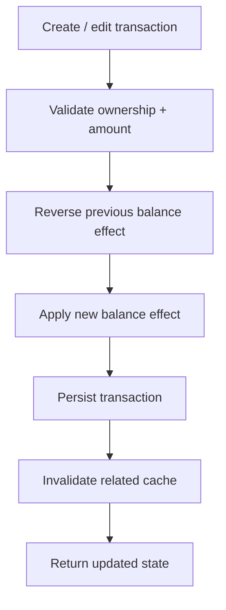
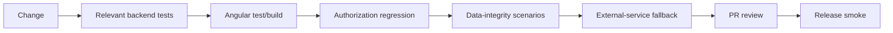
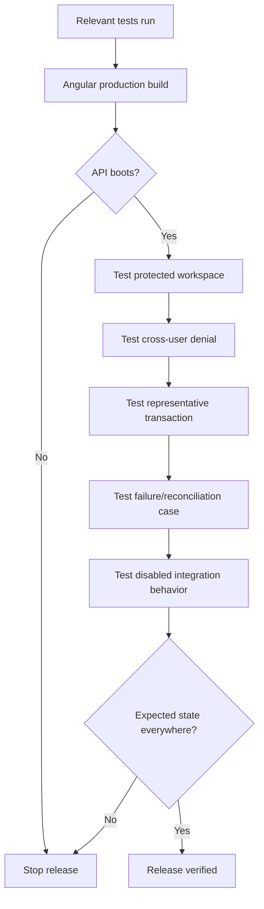

# 🎾 PadelLifeHub — Engineering Blueprint

> **Personal productivity + finance workspace:** Angular → guarded routes → Express/JWT → domain controllers → MongoDB, with optional AI/email/media/scheduled integrations.

**Reviewed snapshot:** `master` @ [`c6cbe598b281`](https://github.com/HidayahMF/PadelLifeHub/commit/c6cbe598b2812e768977ee0d75f01197734e2a29) — 2026-09-17

## ⚡ System snapshot

| Layer | Implementation |
| --- | --- |
| Frontend | Angular `^21.2.0` + TypeScript `~5.9.2` |
| Backend | Express `^4.21.2` |
| Database | MongoDB + Mongoose `^8.9.5` |
| Auth | Bearer JWT + user lookup |
| Core domains | Tasks, transactions, accounts, habits, goals, reports |
| Integrations | AI, email, media, scheduled jobs |
| Tests | Backend Node tests + Angular test command |
| CI | No `.github/workflows/` found in reviewed snapshot |

## 🏗️ Platform architecture

## 🧭 Product domain map

## 🔐 Authentication request journey

## 💰 Finance transaction journey

> **Release-critical:** this path spans multiple writes. The reviewed source does not justify assuming the accounting update is atomic, so failure recovery and reconciliation deserve explicit tests.

## 🗺️ Code ownership map

| Source | Owns |
| --- | --- |
| [`frontend/src/app/app.routes.ts`](https://github.com/HidayahMF/PadelLifeHub/blob/c6cbe598b2812e768977ee0d75f01197734e2a29/frontend/src/app/app.routes.ts) | Public/protected route structure |
| [`backend/app.js`](https://github.com/HidayahMF/PadelLifeHub/blob/c6cbe598b2812e768977ee0d75f01197734e2a29/backend/app.js) | API runtime + route composition |
| [`backend/middleware/auth.js`](https://github.com/HidayahMF/PadelLifeHub/blob/c6cbe598b2812e768977ee0d75f01197734e2a29/backend/middleware/auth.js) | JWT verification + user lookup |
| [`backend/controllers/transactionController.js`](https://github.com/HidayahMF/PadelLifeHub/blob/c6cbe598b2812e768977ee0d75f01197734e2a29/backend/controllers/transactionController.js) | Transaction + balance behavior |
| [`backend/.env.example`](https://github.com/HidayahMF/PadelLifeHub/blob/c6cbe598b2812e768977ee0d75f01197734e2a29/backend/.env.example) | Backend configuration contract |

## 🚀 Developer → release pipeline

```mermaid
flowchart LR
    A[Change request] --> B[Identify owning domain]
    B --> C[Implement focused change]
    C --> D[Backend relevant tests]
    D --> E[Angular tests/build]
    E --> F[Cross-user authorization checks]
    F --> G[Failure-recovery scenarios]
    G --> H[Integration-disabled scenarios]
    H --> I[PR review]
    I --> J[Deploy]
    J --> K[Post-deploy API + UI smoke]
```

### Declared commands

| Area | Commands |
| --- | --- |
| Backend | `npm run dev`, `npm run start`, `npm run test` |
| Frontend | `npm run start`, `npm run test`, `npm run build` |

## 🧪 Verification matrix

| Domain | High-value checks |
| --- | --- |
| Auth | Protected-route reload, expired/invalid token, missing user |
| Ownership | Cross-user access to tasks/accounts/transactions/goals/habits |
| Transactions | Create/edit/delete reconciliation |
| Transfers | Invalid account references + ownership |
| Failure recovery | Error between balance write(s) and transaction save |
| Dates | Recurring dates + edge dates |
| Integrations | AI/email/media unavailable or misconfigured |
| Reports | Export/insight output still reflects source data correctly |

The repository contains backend tests covering AI API/context, parsers, exports, finance insights, focus sessions, Gemini service, investments, notifications, and related behavior. **Test-file presence is not a passing release result**; run the suites relevant to the diff.

## 🛡️ Quality gates

## ⚠️ Risk radar

| Priority | Finding | Impact |
| --- | --- | --- |
| 🔴 High | Finance balance updates span multiple writes | Partial failure can create inconsistent balances/transactions |
| 🔴 High | User-owned domains depend on authorization correctness | Cross-user leaks are possible if route/controller checks regress |
| 🟠 Medium | Optional integrations require separate services/config | Core UI/API health does not prove integrations work |
| 🟠 Medium | Several domains share persisted state | Changes can have cross-domain side effects |
| 🟡 Low | No GitHub Actions workflow found | Release evidence remains procedural unless CI is added |

## 🌐 Release readiness path

## 📌 Engineering rule

For PadelLifeHub, “the endpoint returned 200” is not enough for stateful features. A release should prove **authorization + persisted state + derived balance/report behavior + failure recovery** remain consistent together.

---

### Keeping this blueprint accurate

Update this file whenever route guards, authentication, transaction/balance semantics, MongoDB ownership rules, domain boundaries, or integration contracts change.
