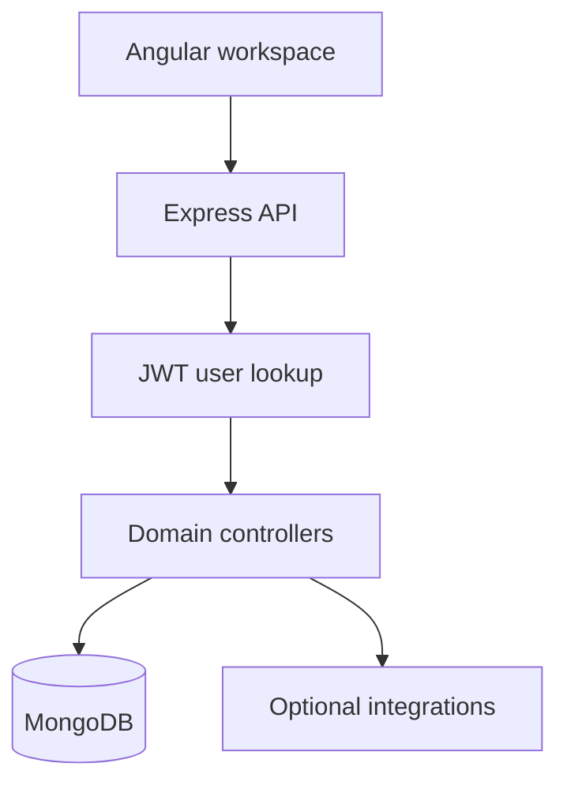

# PadelLifeHub — Development Pipeline

Angular personal productivity and finance application with an Express/Mongoose backend, authenticated records, reports, and optional integrations.

> Source review: **2026-09-17**, branch `master`, commit [`c6cbe598b281`](https://github.com/HidayahMF/PadelLifeHub/commit/c6cbe598b2812e768977ee0d75f01197734e2a29). This is a code-grounded implementation overview and development guide, not a reconstructed historical timeline or a claim that runtime tests passed.

## At a glance

| Area | Finding |
| --- | --- |
| Review scope | Repository tree, dependency manifests, and selected entry points/domain implementations linked below |
| Automated CI | No files under `.github/workflows/` in this source snapshot |
| Validation performed | Static source and documentation review; application builds, tests, databases, and external services were not executed |

## Implemented flow

1. Angular lazily loads public pages and guards the /app workspace.

2. Express verifies bearer tokens, loads the user, and routes requests to task, transaction, account, habit, goal, and related controllers.

3. Transaction updates validate ownership and amounts, reverse previous balance effects, apply new effects, save the record, and invalidate related cache.

### Runtime map

## Source map

Principal source files used for this overview, pinned to the reviewed commit:

- [backend/app.js](https://github.com/HidayahMF/PadelLifeHub/blob/c6cbe598b2812e768977ee0d75f01197734e2a29/backend/app.js)
- [backend/controllers/transactionController.js](https://github.com/HidayahMF/PadelLifeHub/blob/c6cbe598b2812e768977ee0d75f01197734e2a29/backend/controllers/transactionController.js)
- [backend/middleware/auth.js](https://github.com/HidayahMF/PadelLifeHub/blob/c6cbe598b2812e768977ee0d75f01197734e2a29/backend/middleware/auth.js)

- [frontend/src/app/app.routes.ts](https://github.com/HidayahMF/PadelLifeHub/blob/c6cbe598b2812e768977ee0d75f01197734e2a29/frontend/src/app/app.routes.ts)

## Technology and commands

Version ranges below are declarations in source manifests, not independently verified installed versions.

| Manifest | Relevant declarations |
| --- | --- |
| [backend/package.json](https://github.com/HidayahMF/PadelLifeHub/blob/c6cbe598b2812e768977ee0d75f01197734e2a29/backend/package.json) | `express ^4.21.2`, `mongoose ^8.9.5` |
| [frontend/package.json](https://github.com/HidayahMF/PadelLifeHub/blob/c6cbe598b2812e768977ee0d75f01197734e2a29/frontend/package.json) | `@angular/core ^21.2.0`, `typescript ~5.9.2` |

Run each command from the indicated directory after installing the corresponding dependencies and configuring an isolated development environment. Commands are listed as declared; this review does not certify they succeed.

| Directory | Command | Implementation |
| --- | --- | --- |
| `backend` | `npm run start` | Declared: `node server.js` |
| `backend` | `npm run dev` | Declared: `nodemon server.js` |
| `backend` | `npm run test` | Declared: `node --test test/*.test.cjs` |
| `frontend` | `npm run start` | Declared: `ng serve` |
| `frontend` | `npm run build` | Declared: `ng build` |
| `frontend` | `npm run test` | Declared: `ng test` |

## Development sequence

| Stage | Work | Completion evidence |
| --- | --- | --- |
| 1. Establish scope | Read the source map and limitations; choose one concrete behavior to change. | Expected input, output, and failure behavior. |
| 2. Prepare environment | Use the manifests and configuration references. | Required local services reachable with synthetic data. |
| 3. Implement | Follow the implemented flow and update the layer that owns the behavior. | Focused diff with matching caller/callee contracts. |
| 4. Validate | Run applicable declared checks and the scenarios below. | Recorded commands, results, and untested dependencies. |
| 5. Review and release | Review the diff and update documentation; release after environment checks. | Reviewed change and target-environment smoke check. |

These stages are a recommended maintenance sequence, not a historical timeline.

## Configuration and runtime prerequisites

- [backend/.env.example](https://github.com/HidayahMF/PadelLifeHub/blob/c6cbe598b2812e768977ee0d75f01197734e2a29/backend/.env.example)

Configuration-file presence does not prove deployment success. Keep credentials outside version control and use synthetic records during setup.

## Verification plan

Test cross-user access, transfer account validation, edit/delete balance reconciliation, failed writes, recurring dates, and authenticated route reloads.

Test-related files found in the repository tree (13; inventory only, not a passing-test count):

- [backend/test/aiApi.test.cjs](https://github.com/HidayahMF/PadelLifeHub/blob/c6cbe598b2812e768977ee0d75f01197734e2a29/backend/test/aiApi.test.cjs)
- [backend/test/aiContext.test.cjs](https://github.com/HidayahMF/PadelLifeHub/blob/c6cbe598b2812e768977ee0d75f01197734e2a29/backend/test/aiContext.test.cjs)
- [backend/test/deterministicParser.test.cjs](https://github.com/HidayahMF/PadelLifeHub/blob/c6cbe598b2812e768977ee0d75f01197734e2a29/backend/test/deterministicParser.test.cjs)
- [backend/test/exportExcel.test.cjs](https://github.com/HidayahMF/PadelLifeHub/blob/c6cbe598b2812e768977ee0d75f01197734e2a29/backend/test/exportExcel.test.cjs)
- [backend/test/financeInsights.test.cjs](https://github.com/HidayahMF/PadelLifeHub/blob/c6cbe598b2812e768977ee0d75f01197734e2a29/backend/test/financeInsights.test.cjs)
- [backend/test/focusSession.test.cjs](https://github.com/HidayahMF/PadelLifeHub/blob/c6cbe598b2812e768977ee0d75f01197734e2a29/backend/test/focusSession.test.cjs)
- [backend/test/geminiService.test.cjs](https://github.com/HidayahMF/PadelLifeHub/blob/c6cbe598b2812e768977ee0d75f01197734e2a29/backend/test/geminiService.test.cjs)
- [backend/test/investmentMigration.test.cjs](https://github.com/HidayahMF/PadelLifeHub/blob/c6cbe598b2812e768977ee0d75f01197734e2a29/backend/test/investmentMigration.test.cjs)
- [backend/test/investmentService.test.cjs](https://github.com/HidayahMF/PadelLifeHub/blob/c6cbe598b2812e768977ee0d75f01197734e2a29/backend/test/investmentService.test.cjs)
- [backend/test/notificationController.test.cjs](https://github.com/HidayahMF/PadelLifeHub/blob/c6cbe598b2812e768977ee0d75f01197734e2a29/backend/test/notificationController.test.cjs)

Additional test files remain in the repository; inspect runner configuration for the complete suite.

## Known limitations and next work

The inspected balance update path contains multiple writes; test failure recovery rather than assuming atomic accounting. Email, AI, media, and scheduled-job integrations need separately configured services.

Prioritize the acceptance checks above before expanding the feature set. A declared test command or example test does not establish production readiness.

## Keeping this document accurate

Update the source snapshot and affected flow when entry points, persistence, authentication, or integration contracts change. Keep planned capabilities separate from implemented behavior, and record actual build/test results only after running them.
